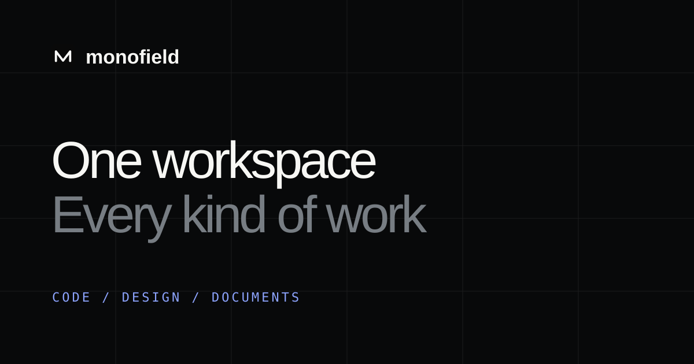

<p align="center">
  <a href="https://monofield.vercel.app">
    
  </a>
</p>

<h1 align="center">MonoField</h1>

<p align="center">
  <strong>code · design · documents</strong><br />
  One field. Every kind of work.
</p>

<p align="center">
  <a href="https://monofield.vercel.app">Website</a> ·
  <a href="https://github.com/jhy0285/monofield/releases">Download</a> ·
  <a href="docs/brand.md">Brand</a> ·
  <a href="docs/open-source-compliance.md">Open-source compliance</a>
</p>

<p align="center">
  
  
  
  
</p>

<p align="center">
  <a href="https://monofield.vercel.app">
    
  </a>
</p>

MonoField is a local-first, open-source AI product workbench. It brings the
working directory, Git changes, running browser, governed database access,
project files, brand context, and preferred model into one visible project
boundary.

The goal is not another chat window. The goal is a continuous path from context
to a reviewable result:

```text
connect                         work                         deliver
repo · files · browser · DB  →  ask · edit · run · review  →  code · deploy
brand · rules · references      test · create · validate      HTML · PPTX
                                                             XLSX · PDF · images
```

> **한국어 소개** — MonoField는 코드베이스, 실행 화면, 승인된 DB, 파일과
> 원하는 AI 모델을 하나의 프로젝트에 연결합니다. 소프트웨어 개발부터 화면·
> 인터페이스 명세, 프로토타입, 슬라이드와 문서 export까지 같은 맥락에서 만들고
> diff·빌드·브라우저·산출물 검증으로 결과를 확인합니다.

## Why MonoField

| Field | What stays connected | Evidence you can review |
| --- | --- | --- |
| **Code** | Selected working directory, Git, build and dev server | Before/after diff, test and build result |
| **Browser** | Approved in-app tab, DOM marks and visual regions | Running UI, interaction and screenshot verification |
| **Data** | Encrypted connection, schema and explicit access policy | Read results, write approval and audit history |
| **Documents** | Code, browser, database, files, dictionaries and brand rules | Editable preview, validation and exported artifact |

This makes two ways of working available without splitting the product:

- **Software development** — inspect and edit the selected codebase, discover
  run configurations, keep development servers alive, review Git changes,
  validate the actual UI in the built-in browser, and use permissioned database
  operations when the task needs them.
- **Document & design production** — create interface and screen
  specifications, responsive pages, prototypes, wireframes, slide decks,
  spreadsheets, PDFs, reports, and reusable structured deliverables.

Ask and Docs are task modes, not project silos. A development project can switch
to Docs to produce a technical specification; a document project can switch to
Ask for explanation, analysis, or review.

## Product principles

- **Local-first** — project files stay in the working folder you choose.
- **Model-independent** — use a local CLI, local model server, BYOK provider,
  or OpenAI-compatible endpoint.
- **Visible control** — diffs, build results, browser approvals, database
  policies, token measurements, and deliverables remain reviewable.
- **One work surface** — development, design, and documents are capabilities of
  one project rather than isolated products.
- **Reusable by teams** — workflows, brand systems, dictionaries, references,
  and project presets can be distributed through an organization-run library.

## Quick start

### Requirements

- Windows 10/11 for the current Desktop build
- Node.js 24
- pnpm through Corepack
- At least one supported local CLI agent or an OpenAI-compatible endpoint

### Run from source

```powershell
corepack enable
pnpm install
pnpm --filter @open-design/web build
pnpm tools-dev start desktop --daemon-port 7456 --prod
pnpm tools-dev status --json
```

The status command reports the active daemon, web, and Desktop processes. Pick a
working folder inside MonoField to make it the CLI agent's project root.

Useful focused checks:

```powershell
pnpm --filter @open-design/contracts typecheck
pnpm --filter @open-design/web exec tsc -b --noEmit --force
pnpm --filter @open-design/web build
pnpm --filter @open-design/daemon exec tsc -p tsconfig.json --noEmit
```

The preferred product name and executable command are `MonoField` and
`monofield`. Historic `open-design`, `open-docs`, `od`, and `template`
identifiers remain only where compatibility with existing data, packages, or
integrations requires them.

## Security and data boundary

MonoField keeps project data and stored credentials locally by default.
Credentials are referenced by connection ID and remain in the encrypted Desktop
vault; they are not inserted into model prompts. Database access is governed by
the selected policy and sensitive writes require the corresponding permission
or approval.

Local-first does **not** mean an external model receives nothing. When you select
an external runtime, the prompt and the context explicitly sent for that run are
processed by that provider under its own terms. Review the provider, project
policy, and selected context before using confidential data.

See [PRIVACY.md](PRIVACY.md) and [SECURITY.md](SECURITY.md) for the full boundary
and reporting process.

## Repository map

```text
apps/
  daemon/          local API, agent runtimes, Git, DB and document services
  desktop/         Electron shell, encrypted vault and in-app browser
  web/             product UI
  monofield-site/  public website
packages/
  contracts/       shared API and prompt contracts
  components/      reusable UI primitives
plugins/           official and community workflows
tools/             development, packaging and release tooling
```

## Open source and attribution

MonoField is an independent derivative of the Apache-2.0 licensed
[Open Design](https://github.com/nexu-io/open-design) project. It is not
affiliated with, endorsed by, or maintained by that project.

The user-facing product identity, workflows, integration layer, document
systems, browser tooling, database governance, and MonoField modifications are
maintained in this repository. Required upstream and third-party notices remain
in [LICENSE](LICENSE), [NOTICE](NOTICE), and
[THIRD_PARTY_NOTICES.md](THIRD_PARTY_NOTICES.md).

For release requirements, see
[docs/open-source-compliance.md](docs/open-source-compliance.md). For product
identity rules, see [docs/brand.md](docs/brand.md).

---

<p align="center"><strong>One field. Every kind of work.</strong></p>
